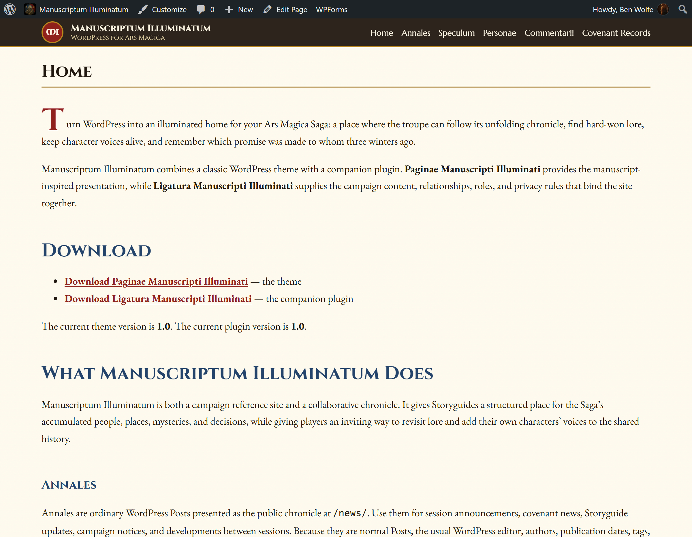
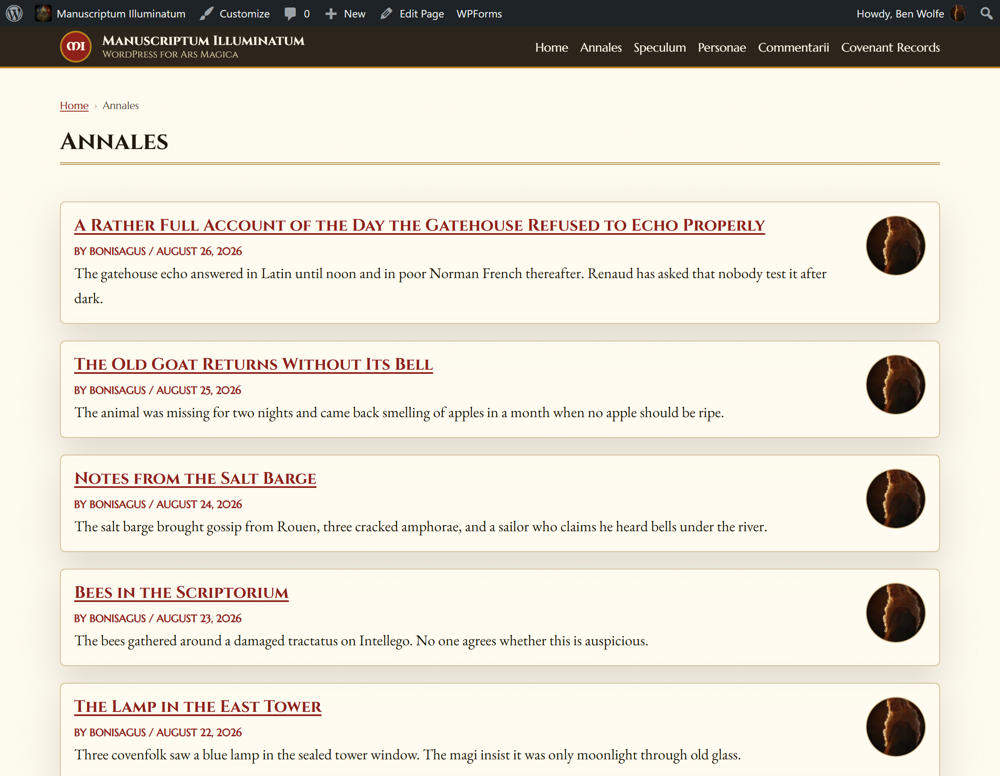
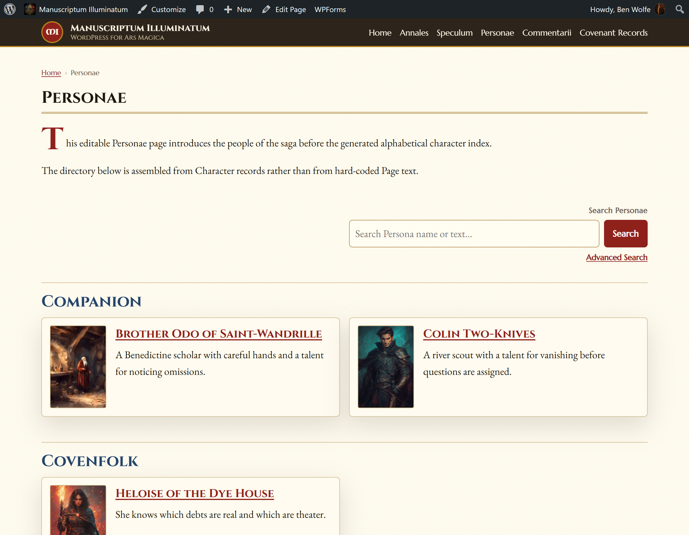
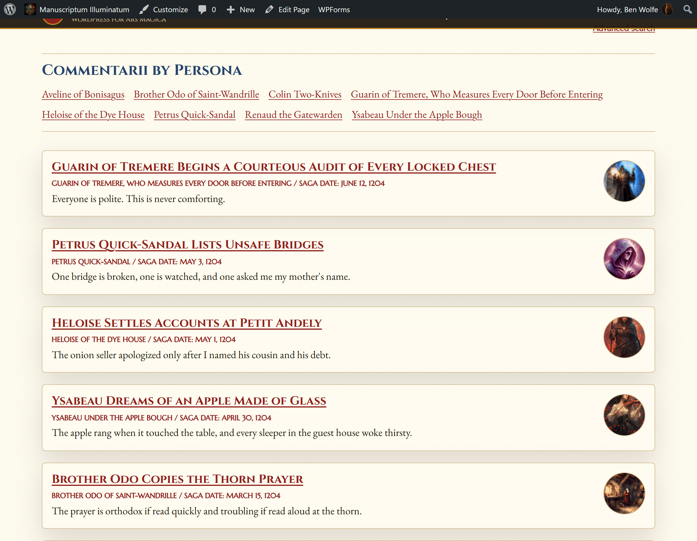
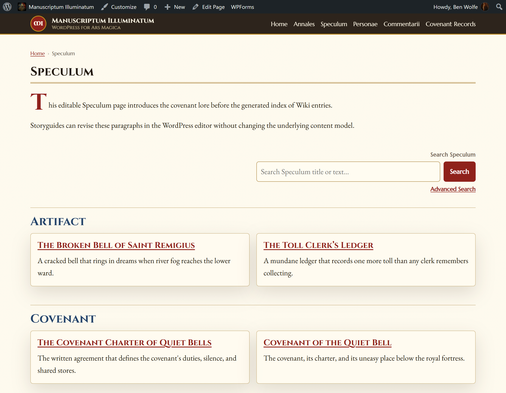
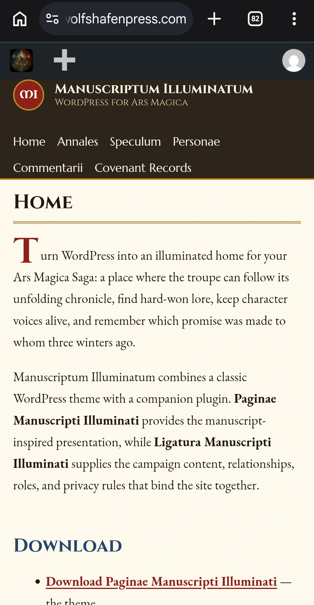

# Manuscriptum Illuminatum

Turn WordPress into an illuminated home for your Ars Magica Saga: a place where the troupe can follow its unfolding chronicle, find hard-won lore, keep character voices alive, and remember which promise was made to whom three winters ago.

Manuscriptum Illuminatum combines a classic WordPress theme with a companion plugin. **Paginae Manuscripti Illuminati** provides the manuscript-inspired presentation, while **Ligatura Manuscripti Illuminati** supplies the campaign content, relationships, roles, and privacy rules that bind the site together.

## Screenshots







## Download

- **[Download Paginae Manuscripti Illuminati](https://raw.githubusercontent.com/benjaminisawolfe/manuscriptum-illuminatum/main/packages/paginae-manuscripti-illuminati.zip)** — the theme
- **[Download Ligatura Manuscripti Illuminati](https://raw.githubusercontent.com/benjaminisawolfe/manuscriptum-illuminatum/main/packages/ligatura-manuscripti-illuminati.zip)** — the companion plugin

The current theme version is **1.0**. The current plugin version is **1.0**.

## What Manuscriptum Illuminatum Does

Manuscriptum Illuminatum is both a campaign reference site and a collaborative chronicle. It gives Storyguides a structured place for the Saga’s accumulated people, places, mysteries, and decisions, while giving players an inviting way to revisit lore and add their own characters’ voices to the shared history.

### Annales

Annales are ordinary WordPress Posts presented as the public chronicle at `/news/`. Use them for session announcements, covenant news, Storyguide updates, campaign notices, and developments between sessions. Because they are normal Posts, the usual WordPress editor, authors, publication dates, tags, and drafting workflow remain familiar.

### Speculum

Speculum is the Saga’s reference work: an encyclopedia for places, people, factions, events, mysteries, artifacts, spells, and everything else the troupe learns along the way. Entry Types divide a growing collection into useful kinds of lore, while Saga Topics gather entries that belong to the same ongoing concern. It's found at `/wiki/`.

### Personae

Personae is the character directory for player characters, magi, companions, grogs, covenfolk, notable NPCs, and creatures. It presents important character information cleanly, associates a Persona with its player where appropriate, and connects characters with other campaign records. Storyguide-only information retains its separate permission checks and is not folded into the public character presentation. It's found at `/characters/`.

### Commentarii

Commentarii are in-world or player campaign journals. They suit diaries, character viewpoints, session chronicles, correspondence, lab reflections, confessions, and personal accounts that may disagree delightfully with the official record. A Commentarium can be associated with a Persona, allowing its visible author to be the character rather than merely the underlying WordPress account. Players can therefore help write the Saga’s history in voices that belong inside it. It's found at `/journals/`.

### Covenant Records

Covenant Records preserve the institution’s practical and official memory separately from personal journals and general lore. They can hold council decisions, inventories, agreements, projects, library or vis records, laboratories, buildings, charter history, and other documents the troupe will want to consult again. It's found at `/covenant/`.

### Saga Topics

Saga Topics are cross-cutting tags that connect related material across the campaign. A recurring noble family, Hermetic dispute, faerie regio, Tribunal issue, or long-running mystery can have associated material in Speculum, Personae, Commentarii, and Covenant Records. Following a topic reveals the threads of a story even when they pass through several kinds of record. Saga Topics can be assigned to any post or page.

### Storyguide and Player Use

Storyguides gain organized Saga information, structured references, protected Storyguide-only material where supported by third party plungs, and an easy player for players and Storyguides to find historical Saga material. Players gain character-focused journals, an accessible Persona directory, the lore their characters have accumulated, and a shared record of the Saga that grows through play rather than sitting forgotten in someone’s notes.

## Requirements

- WordPress 6.5 or newer.
- PHP 8.0 or newer.
- Pretty permalinks enabled.
- A normal WordPress media library with uploads enabled.

No separate custom-fields or campaign data-model plugin is required.

### Suggested Plugins
[Akismet](https://wordpress.org/plugins/akismet/) - Anti-spam guard.

[Wordfence](https://www.wordfence.com/) - For security purposes, you can't do better.

[WP Mail SMTP](https://wpmailsmtp.com/) - Great for making sure mail send from your installation gets where it needs to go and bypasses spam guards.

## Installation

1. Download both ZIP files above without unzipping them.
2. In WordPress, open **Plugins → Add New Plugin → Upload Plugin**.
3. Upload `ligatura-manuscripti-illuminati.zip`, install it, and activate **Ligatura Manuscripti Illuminati**.
4. Open **Appearance → Themes → Add New Theme → Upload Theme**.
5. Upload `paginae-manuscripti-illuminati.zip`, install it, and activate **Paginae Manuscripti Illuminati**.
6. Open **Settings → Permalinks** and click **Save Changes** once.

Install and activate the plugin first so its campaign content types and permissions are ready before the theme presents them. The [installation guide](docs/INSTALLATION.md) includes a fuller checklist.

## First Setup

On a fresh site, the theme safely creates or adopts the six expected Pages: Home, Annales, Speculum, Personae, Commentarii, and Covenant Records. It preserves existing Page content, reports slug conflicts instead of inventing alternate public URLs, and does not create duplicates on later checks.

When WordPress is still unconfigured, Home becomes the static front page and Annales becomes the Posts page. A six-item default Primary Menu is created only when that menu location has never been configured. A matching Page in Trash can be restored with its content; genuinely missing Pages are repaired during a later administrator visit, never by writing during an ordinary visitor request.

After activation:

1. Review **Settings → Reading** and confirm Home and Annales.
2. Save **Settings → Permalinks**.
3. Review **Appearance → Menus**.
4. Open **Appearance → Customize** and choose the site’s identity, typography, colours, layout, and footer text.
5. Create Storyguide and Player accounts only after reading the privacy and roles guidance.

## Navigation and Menus

The header uses WordPress’s standard **Primary Menu** location. In **Appearance → Menus**, you can add, remove, rename, and reorder Pages, campaign entries, taxonomy collections, or custom links without editing theme files.

To create a submenu, drag a menu item slightly to the right beneath its parent, then save. Native parent/child menus work with desktop pointer interaction, keyboard focus, and the theme’s mobile submenu control. The setup routine never replaces an administrator’s selected menu or repopulates a location that was deliberately cleared.

## Customizing the Theme

Open **Appearance → Customize → Paginae Manuscripti Illuminati**. Available controls include:

- sidebar layout and content width;
- sticky header and the short seal text shown without a custom logo;
- body, heading, navigation, and accent typography;
- manuscript colours and parchment texture;
- Speculum table-of-contents behavior;
- the number of latest Commentarii shown on Home;
- **Footer → Footer copyright text**.

The footer setting accepts plain text. Use `{year}` to insert the current year, or save an empty value to hide the copyright line cleanly.

## Login and Admin Security

Login-only access is the secure default for front-end pages, feeds, and REST content. Storyguide-only notes keep their capability checks in either privacy mode. A site owner who deliberately wants published front-end material to be public can add this to `wp-config.php`:

```php
define( 'LIGATURA_MANUSCRIPTI_ILLUMINATI_REQUIRE_LOGIN', false );
```

Administrators manage the whole WordPress site. Storyguides manage campaign records and protected notes. Players can contribute their own Commentarii, use assigned Personae as Character Authors, and work with permitted character and media records without receiving broad administrative powers.

Direct files under `wp-content/uploads` are normally served by the web server rather than the plugin’s PHP login gate. Ask your host about private media or CDN protection if uploaded files themselves are confidential. See [Content, Privacy, and Roles](docs/CONTENT-PRIVACY-AND-ROLES.md) before inviting players.

## Using the Campaign Sections

- Write ordinary WordPress Posts when something belongs in **Annales**.
- Add stable people, places, objects, events, or mysteries to **Speculum**, then assign Entry Types and Saga Topics.
- Create **Personae** for characters and creatures, choosing a Character Type before publication.
- Use **Commentarii** for personal or in-world accounts, assigning a Character Author and optional Saga Date.
- Keep institutional decisions, resources, projects, and inventories in **Covenant Records**.
- Reuse **Saga Topics** across content types whenever several records belong to the same developing story.

The [content guide](docs/CONTENT-PRIVACY-AND-ROLES.md) explains the content types and permissions in more detail.

## Updating

Back up the database and `wp-content` first. Upload the newer plugin ZIP through **Plugins → Add New Plugin → Upload Plugin** and approve replacing the installed version, then replace the theme through **Appearance → Themes → Add New Theme → Upload Theme**. Keep the plugin active, confirm the theme is active, save permalinks once, and inspect the main campaign routes.

## Troubleshooting

- If a main route returns 404, save **Settings → Permalinks** once and clear any host or CDN cache.
- If a default Page is missing, visit an administration screen as an Administrator and read the setup notice.
- If the header is empty or incorrect, assign a menu to **Primary Menu** under **Appearance → Menus → Manage Locations**.
- If a Player cannot edit a Persona or choose a Character Author, confirm the Player role and Persona assignment.
- If visitors are sent to login, remember that login-only mode is the default rather than a routing failure.

More detailed remedies are collected in [Troubleshooting](docs/TROUBLESHOOTING.md).

## Additional Documentation

- [Installation and updates](docs/INSTALLATION.md)
- [Site configuration](docs/CONFIGURATION.md)
- [Content, privacy, and roles](docs/CONTENT-PRIVACY-AND-ROLES.md)
- [Troubleshooting](docs/TROUBLESHOOTING.md)
- [Product changelog](CHANGELOG.md)
